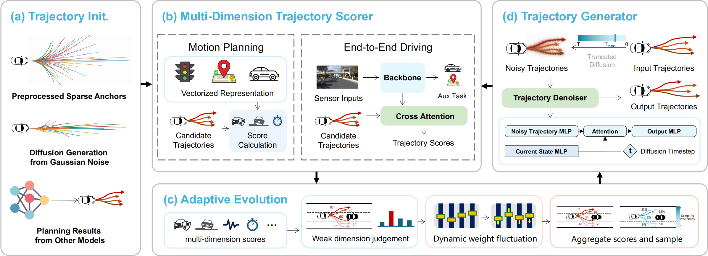
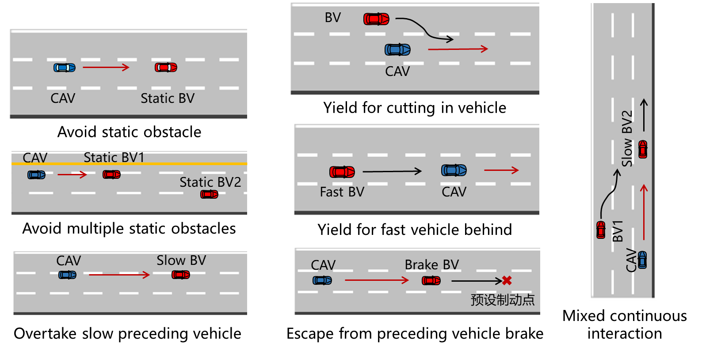

# GRADE: Guiding Realistic Autonomous Driving with Adaptive Trajectory Evolution

 <!-- TODO: Update arXiv link -->

---

## 📅 Release Roadmap

- [x] **README**
- [ ] **Environment Setup**
- [ ] **Source Code**
- [ ] **Training & Evaluation**

⭐ Star for updates!

---

## 📖 Overview

  

Autonomous driving requires generating high-quality trajectories that balance multiple competing objectives (safety, comfort, efficiency) across complex scenarios. Existing methods typically rely on a single aggregated reward, struggling to explicitly model trade-offs between different planning objectives.

**GRADE** addresses this by introducing a unified planning framework with adaptive weight fluctuation that dynamically adjusts the importance of different factors during optimization. It achieves SOTA performance on both **nuPlan** (motion planning) and **NAVSIM** (end-to-end driving) benchmarks.

---

## 🏗️ Framework

  

GRADE consists of three core components:

1. **Diffusion-based Trajectory Generator**: Lightweight unconditional diffusion model for diverse proposals
2. **Multi-dimensional Scorer**: Evaluates trajectories across safety, comfort, efficiency, etc.
3. **Adaptive Evolution Loop**: Identifies weak dimensions and adjusts weights iteratively

---

## 🏆 Results

### nuPlan Benchmark (Motion Planning)

| Method | Val14 | Test14-hard | Test14 |
|--------|-------|-------------|--------|
| PDM-Closed | 92.12 | 75.19 | 91.63 |
| PDM-Hybrid | 92.11 | 76.07 | 91.28 |
| PLUTO | 76.88 | 76.88 | 90.29 |
| **GRADE (Ours)** | 90.36 | **80.06** | **91.65** |

### NAVSIM Benchmark (End-to-End Driving)

| Method | NC | DAC | TTC | Comf. | EP | PDMS |
|--------|----|----|-----|-------|----|----|
| DiffusionDrive | 98.2 | 96.2 | 94.7 | 100 | 82.2 | 88.1 |
| iPad | 98.6 | 98.3 | 94.9 | 100 | 88.0 | 91.7 |
| **GRADE (Ours)** | 97.0 | 98.6 | 92.2 | 99.8 | 85.6 | 89.4 |
| GRADE + DiffDrive | 98.6 | 98.8 | 95.2 | 99.8 | 86.4 | 91.4 |
| **GRADE + iPad** | **98.8** | **99.0** | **95.3** | 100 | 87.6 | **92.1** |

---

## 🚗 Real-vehicle Validation

  

  

Validated on real autonomous vehicles across 6 scenarios in Suzhou, China, involving various interactions with human-driven vehicles.

